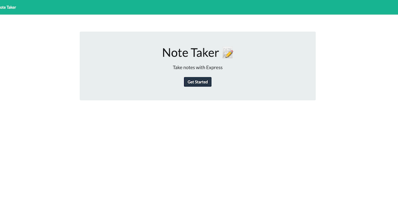
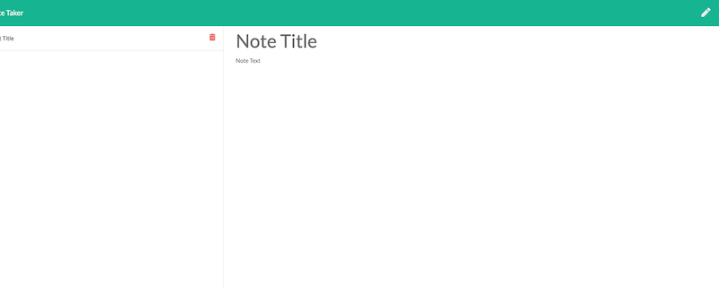
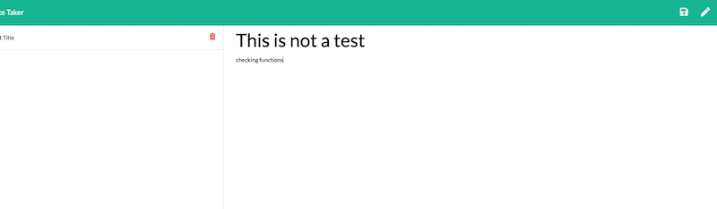
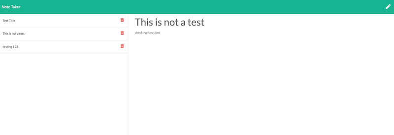
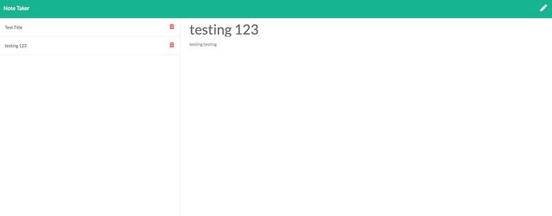

# Team Profile Generator
  
  ## Table of Contests
  -[Description](#description)
  -[Instalation](#install)
  -[Usage](#usage)
  -[Licences](#licences)
  -[Contribution](#contribution)
  -[Test](#tests)
  -[Question](#questions)
  
  
  ## Description
The project must generate a `team.html` page in the `output` directory, that displays a nicely formatted team roster. Each team member should display the following in no particular order:
  
  ## Install

  npm install
  
  ## Usage

  AS A user, I want to be able to write and save notes

I WANT to be able to delete notes I've written before

SO THAT I can organize my thoughts and keep track of tasks I need to complete
  
  ## Licence

  None
  
  ## Contribution

  
  ## Test
  
  NA
  
  ## Questions

  ### [cfergus7 GitHub](https://github.com/)  
  
  ### Email cfergus7@gmail.com

  ### https://dashboard.heroku.com/apps/whispering-oasis-17117

  ## Screen Shots
  
  
  
  
  

